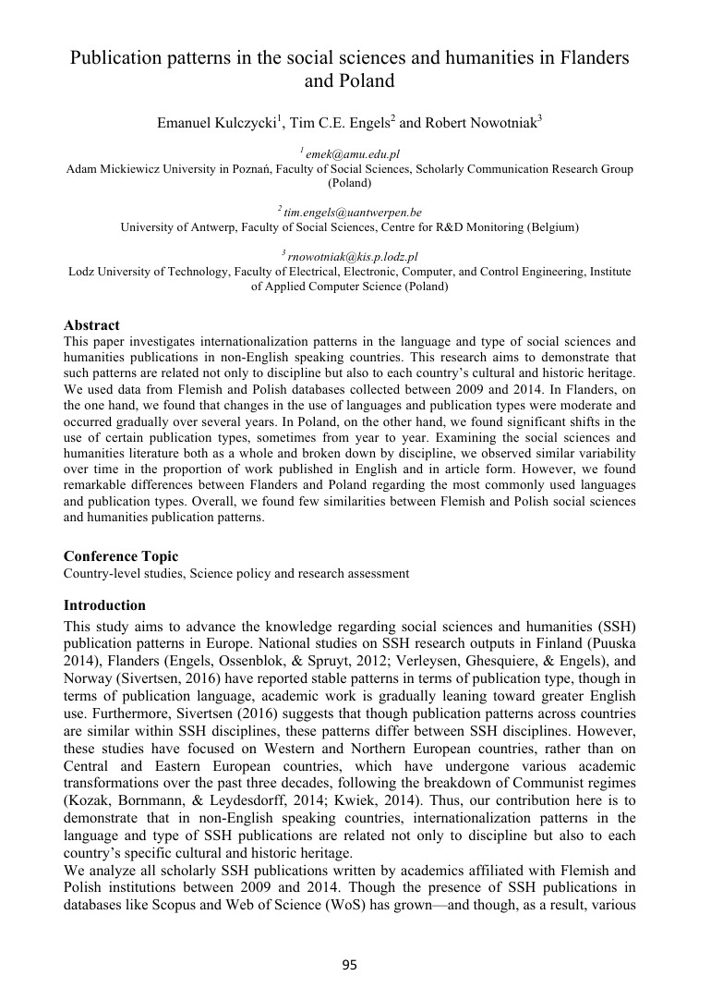

# Polish-Scholarly-Bibliography, 2017

Full results of this analysis with conclusions and thorough comments have been published in a scientific paper:

* Kulczycki, E., Engels, T., Nowotniak., R. (2017). Publication patterns in the social sciences and humanities in Flanders and Poland. In: Proceedings of ISSI 2017 Wuhan: 16th International Society of Scientometrics and Informetrics Conference, Wuhan, China, 16–20 October 2017, pp. 95–104. -- <a href="Publication patterns in the social sciences and humanities in Flanders and Poland.pdf">[Full text PDF]</a>

